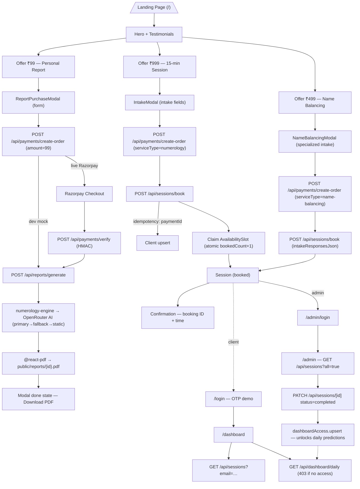

# Numerology Coach Funnel — Architectural Analysis

A Next.js 14 (App Router) single-page funnel with a payment-gated AI report, two session-booking offers, a gated client dashboard, and an admin console.

---

## 1. Directory Structure

```
Numerology/
├── app/                          # Next.js App Router
│   ├── layout.tsx                # Root layout (fonts, global styles)
│   ├── page.tsx                  # LANDING PAGE (single-page funnel)
│   ├── globals.css
│   ├── login/page.tsx            # Client portal OTP login (demo)
│   ├── dashboard/page.tsx        # Client dashboard (daily predictions, booking, history)
│   ├── admin/
│   │   ├── login/page.tsx        # Admin login (hardcoded demo creds)
│   │   └── page.tsx              # Admin console (sessions, analytics, availability, media)
│   └── api/                      # Route handlers
│       ├── payments/
│       │   ├── create-order/route.ts   # POST — Razorpay order (or dev mock)
│       │   └── verify/route.ts         # POST — HMAC signature verification
│       ├── reports/
│       │   ├── generate/route.ts       # POST — numerology engine + AI + PDF
│       │   ├── [id]/route.ts           # GET — report record
│       │   └── [id]/download/route.ts  # GET — stream PDF
│       ├── sessions/
│       │   ├── route.ts                # GET — list (client by email | admin ?all=true)
│       │   ├── book/route.ts           # POST — book session, claim slot (idempotent)
│       │   └── [id]/route.ts           # PATCH — status/notes; unlocks dashboard on complete
│       ├── availability/
│       │   ├── route.ts                # GET/POST slots
│       │   └── [id]/route.ts           # PATCH/DELETE slot
│       ├── dashboard/
│       │   ├── access/route.ts         # GET/POST dashboard-access grant/check
│       │   └── daily/route.ts          # GET — cached daily prediction (403 if no access)
│       └── numerology/calculate/route.ts
├── components/                   # UI (shadcn-style primitives + funnel sections)
│   ├── hero.tsx, testimonials.tsx, about.tsx, footer.tsx, header.tsx
│   ├── offer-report.tsx          # ₹99 Report offer section
│   ├── report-purchase-modal.tsx # 4-step checkout: form → paying → generating → done
│   ├── session-offer.tsx         # ₹999 15-min session offer
│   ├── intake-modal.tsx          # Session booking modal (uses SessionIntakeFields)
│   ├── session-intake-fields.tsx
│   ├── name-balancing-offer.tsx  # ₹499 Name Balancing offer
│   ├── name-balancing-modal.tsx  + name-balancing-intake-fields.tsx
│   ├── availability-preview.tsx, booking-slots.tsx (dashboard)
│   ├── aura-preview.tsx, mandala.tsx, landing-image.tsx
│   ├── admin/ (analytics, availability-manager, media-manager)
│   └── ui/ (button, card, dialog, input, label, table)
├── lib/
│   ├── db.ts                     # Prisma singleton
│   ├── services.ts               # SERVICE_TYPES registry (numerology, name-balancing) + prices
│   ├── numerology-engine.ts      # Western + Vedic/Chaldean calculation engine
│   ├── interpretations.ts        # Master's static interpretation library
│   ├── report-service.ts         # Engine → AI → PDF pipeline (idempotent by paymentId)
│   ├── pdf-report.tsx            # @react-pdf branded PDF document
│   ├── daily-predictor.ts        # Daily prediction w/ DB caching + access guard
│   ├── availability.ts           # IST slot seeding (weekly defaults), formatting
│   ├── session-intake.ts         # Intake field defs + defaults
│   ├── portal-data.ts, utils.ts
│   └── ai/
│       ├── openrouter.ts         # OpenRouter client (primary + fallback model)
│       ├── report-prompts.ts     # System/user prompt builder
│       ├── report-schema.ts      # Zod + JSON-schema for structured AI output
│       ├── report-ai.ts          # AI pipeline + deterministic static fallback
│       └── quality.ts            # Quality gate validation
├── prisma/
│   ├── schema.prisma             # 7 models
│   └── migrations/               # init + name-balancing session fields
├── public/
│   ├── fonts/                    # Playfair Display + Inter (self-hosted)
│   └── reports/*.pdf             # Generated report artifacts
├── scripts/test-numerology.ts    # Engine smoke test
├── next.config.mjs, tailwind.config.ts, components.json
└── .env(.example/.local)         # DB, OpenRouter, Razorpay keys
```

---

## 2. Tech Stack & Libraries

| Layer | Choice |
|---|---|
| Framework | **Next.js 14.2 (App Router, RSC + client components)**, React 18 |
| Language | TypeScript 5.7 |
| Styling | Tailwind CSS 3.4 with custom design tokens (`gold`, `midnight`, `cosmic`, Playfair Display + Inter fonts) |
| UI primitives | Radix UI (Dialog) + shadcn-style components (`components/ui/*`) |
| Database | **PostgreSQL via Prisma 5.22** (local dev falls back to `file:./numerology.db` SQLite) |
| Payments | **Razorpay** (order creation server-side, client-side checkout.js, HMAC-SHA256 signature verification). Dev mode returns mock orders when keys absent. |
| AI | **OpenRouter** — primary `openai/gpt-5`, fallback `google/gemini-2.5-pro`, structured JSON output via `response_format.json_schema`, token usage tracked |
| PDF | **@react-pdf/renderer** (`serverComponentsExternalPackages`) — branded report rendered server-side to `public/reports/{id}.pdf` |
| Validation | Zod 4 |
| Charts | Recharts (admin analytics) |
| Icons | lucide-react |
| Deployment | Netlify build artifacts present (`.netlify/`); `.vercel-token` also present |

---

## 3. User Flow & Routing

There is **no multi-page funnel** — the marketing funnel is a **single landing page** (`/`) with three stacked offers, each opening a client-side modal. Post-purchase value lives behind `/login` → `/dashboard`. No thank-you page exists as a route; "thank you" is the modal's final state.

### Step-by-step journey

1. **Landing (`/`)** — `page.tsx` renders `Header → Hero → Testimonials → OfferReport → SessionOffer → NameBalancingOffer → AvailabilityPreview → AuraPreview → About → Footer`.

2. **Front-end offer: ₹99 Report** (`offer-report.tsx` → `report-purchase-modal.tsx`)
   - Form: name, full birth name, DOB, current name, email, phone, focus area, question.
   - `POST /api/payments/create-order` (with `amount: 99`) → Razorpay order.
   - If keys configured: open Razorpay checkout; on success `POST /api/payments/verify` (HMAC) → `POST /api/reports/generate`.
   - If dev mode: skip payment widget, call generate directly with the mock `orderId`.
   - Generate: engine calculates core numbers → AI narrative (primary/fallback/static) → PDF render → store. Show `done` state with Life Path result + **Download PDF** link (`/api/reports/{id}/download`).

3. **Mid-funnel upsell: ₹999 15-min Session** (`session-offer.tsx` → `intake-modal.tsx`)
   - Intake fields (`session-intake-fields.tsx`), creates mock/real order via `create-order` with `serviceType: "numerology"` (price from `lib/services.ts`), then `POST /api/sessions/book` — idempotent by `paymentId`, creates/updates Client, claims an availability slot atomically, creates Session.
   - Confirmation shows booking ID + scheduled time; "dashboard unlocks after first session".

4. **Secondary upsell: ₹499 Name Balancing** (`name-balancing-offer.tsx` → `name-balancing-modal.tsx`)
   - Same booking pipeline with `serviceType: "name-balancing"` and specialized intake (name type, language, pronunciation, usage context, candidate names, etc.) stored as `intakeResponsesJson`.

5. **Client login (`/login`)** — demo OTP flow (hardcoded creds, localStorage flag `aura_user_authenticated` + `aura_user_email`).

6. **Dashboard (`/dashboard`)** — `GET /api/sessions?email=...` for history; numerology profile computed client-side from demo client; daily guidance uses `PERSONAL_DAY_GUIDANCE` + local energy-score calc; book sessions via `booking-slots.tsx`; upgrade nudge to `/offer-999`.

7. **Admin (`/admin/login` → `/admin`)** — localStorage guard; `GET /api/sessions?all=true` (15s polling); open session dialog → `PATCH /api/sessions/[id]` to set status/notes/admin analysis. **Marking completed triggers `dashboardAccess.upsert`** — this is the gating mechanism for `/api/dashboard/daily`.

### Mermaid diagram



---

## 4. Data Models (Prisma — `prisma/schema.prisma`)

| Model | Purpose | Key fields |
|---|---|---|
| **Client** | Canonical customer record | `name`, `fullBirthName`, `currentName`, `dateOfBirth`, `email`, `phone`, `focusArea`, `question`, `goal` → 1:N Report, Session, DailyPrediction, 1:1 DashboardAccess |
| **Report** | Paid PDF deliverable | Calculated numbers (lifePath/expression/soulUrge/personality/personalYear), `luckyNumbers`/`numerologyFactsJson` (JSON strings), `paymentStatus` (pending/paid/failed/free), `paymentId @unique` (**idempotency key**), `reportStatus`, `pdfPath`, AI tracking fields (`aiContentJson`, `aiModel`, `aiStatus`, token usage, prompt/methodology versions) |
| **Session** | Booked consultation | `serviceType` (numerology/name-balancing), `focusArea`/`subFocusArea`, `pricePaid`, `scheduledAt`, `duration`, `status` (booked/completed/cancelled), `paymentId @unique`, `intakeResponsesJson`, `adminAnalysisJson`, `notes`, optional `availabilitySlotId` |
| **AvailabilitySlot** | Calendar capacity | `startsAt/endsAt` (IST), `timezone`, `capacity`, `bookedCount`, `isActive`; unique `(startsAt, endsAt)`; bookings atomically increment `bookedCount` |
| **DashboardAccess** | Session gating | 1:1 `clientId`, `isActive`, `grantedAt`, `expiresAt`; granted when admin marks a session completed |
| **DailyPrediction** | Cached daily guidance | `date` + `clientId` unique, `luckyNumbers`, `energyScore`, `dos/donts` (JSON), `prediction`, `theme`, `personalDay` |
| **Interpretation** | Static "Master library" | `numberKey @unique` (e.g. `life_path_7`), title/summary/fullText, strengths/challenges, career/love/health guides, lucky numbers, colors, gemstones, affirmations, Vedic notes, dos/donts |

**Replication notes:** Payment/booking endpoints use `paymentId` as an idempotency key (safe retries, no double AI calls or double slot claims). Slot claiming is atomic (`updateMany … where bookedCount < capacity`). Dashboard access is the "entitlement" model tying a completed paid session to ongoing client value.

---

## 5. Key Takeaways for Replication

- **Everything niche-specific is centralized**: `lib/services.ts` (offer/pricing registry), `lib/interpretations.ts` (coach's content library), `lib/numerology-engine.ts` (domain logic), and `lib/ai/report-prompts.ts` + schema (AI persona). Swap these and the UI/API stays intact.
- **One-page funnel + modal checkouts** rather than multi-page checkout/upsell/thank-you — final states live inside modals.
- **Two-stage monetization**: ₹99 front-end report → ₹999/₹499 session upsell → gated dashboard ("thank-you → retention loop").
- **Auth is demo-only** (hardcoded creds + localStorage) — production would need real auth/session handling.
